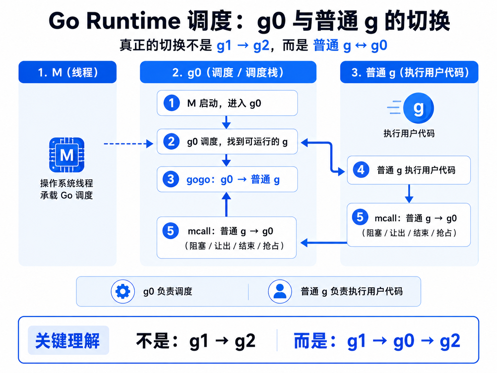

[解说Golang GMP 实现原理_哔哩哔哩_bilibili](https://www.bilibili.com/video/BV1oT411Y7m3/?spm_id_from=333.337.search-card.all.click&vd_source=13dfbe5ed2deada83969fafa995ccff6)

[Weixin Official Accounts Platform](https://mp.weixin.qq.com/s/jIWe3nMP6yiuXeBQgmePDg)

> **并发 Concurrency**：指程序在一段时间内处理多个任务。它强调的是“任务之间可以交替推进”，不一定真的在同一时刻执行。
>
> **并行 Parallelism**：指多个任务在同一时刻真正同时执行。它强调的是“物理上同时发生”，通常需要多核 CPU 或多台机器。

线程：通常指的是内核级线程：

1. 是OS中最小调度单元
2. 创建、销毁、调度交由内核完成，cpu需要完成用户态和内核态的切换
3. 可以充分利用多核，实现并行

协程，通常为用户级线程：

1. 与线程存在映射关系，协程：线程 M：1
2. xxx由用户态完成，对内核透明，所以更轻
3. 从属于同一个内核级线程，无法**并行**，一个协程阻塞会导致从属同一线程的所有协程无法执行

 

goroutine，经go优化后的特殊**协程**：

1. 与线程存在映射关系，为 M：N
2. xxx由用户态完成，对内核透明，足够轻便
3. 可利用多个线程，实现并行
4. 通过调度器的调度，实现和线程间的动态绑定和灵活调度
5. 栈空间大小可动态扩展


| 模型      | 弱依赖内核 | 可并行 | 可应对阻塞 | 栈可动态扩缩 |
| --------- | ---------- | ------ | ---------- | ------------ |
| 线程      | ❌          | ✅      | ✅          | ❌            |
| 协程      | ✅          | ❌      | ❌          | ✅            |
| goroutine | ✅          | ✅      | ✅          | ✅            |


## GMP模型

GMP = goroutine ＋ machine ＋ processor

> machine是OS级线程。
>
> processor是调度器。


**G**有自己的运行栈、状态、以及执行的任务函数。G需要绑定P才能执行，在G的视角中，P就是它的cpu。


**P**是GMP的中枢，由P承上启下，实现G和M之间的动态有机结合。对G而言P是cpu，G只有被P调用才可以执行。

对于M而言，P是执行代理，为其提供必要信息的同时，隐藏了复杂的调度细节。

P的数量决定了G最大并行数量。


**M**不直接执行G，而是先和P绑定，由其实现代理。借由P的存在，M无需和G绑定死，也无需记录G的状态信息。G在生命周期中可以实现跨M执行。


G的存在队列有三类：P的本地队列；全局队列；和wait队列（为io阻塞就绪态goroutine队列）

M调度G时，优先取P本地队列，其次取全局队列，最后取wait队列。这样的好处是取本地队列时，可以接近于无锁化，减少全局锁竞争。

为防止不同P的负载过大，设立work-stealing机制，本地队列为空的P可以尝试从其他P本地队列调度一半的G补充到自身队列。

## 核心数据结构

GMP 相关结构主要在 `runtime/runtime2.go` 中，字段很多，只抓调度相关的核心部分。

### g

`g` 表示 goroutine，核心字段是 `m *m` 和 `sched gobuf`。

- `m`：当前负责执行该 `g` 的 OS 线程。
- `sched`：保存 `g` 被切走时的执行现场。其中 `sp` 是栈顶，`pc` 是下一条指令地址，`ret` 保存返回值，`bp` 保存栈帧基址。

`g` 常见状态：

- `_Gidle`：创建中，尚未初始化完成。
- `_Grunnable`：可运行，等待调度。
- `_Grunning`：正在运行。
- `_Gsyscall`：正在执行系统调用。
- `_Gwaiting`：阻塞等待，如 channel、锁、GC、timer 等。
- `_Gdead`：未使用或已经结束。
- `_Gcopystack`：正在进行栈扩缩容。
- `_Gpreempted`：被抢占，等待再次调度。

### m

`m` 表示 OS 线程，真正执行代码的是它。

- `g0`：每个 `m` 独有的调度 goroutine，只负责调度和切换，不执行用户代码。
- `tls`：线程本地存储，用来快速找到当前正在运行的 `g`，再顺着找到 `m`、`p`、`g0`。

### p

`p` 表示调度资源，可以理解为运行 `g` 所需的“执行令牌”。

- `runq`：本地可运行队列，容量为 256。
- `runqhead/runqtail`：维护本地队列的头尾。
- `runnext`：下一个优先执行的 `g`。

### schedt

`schedt` 是全局调度器状态。

- `lock`：操作全局队列时使用的锁。
- `runq`：全局可运行队列。
- `runqsize`：全局队列中的 `g` 数量。

整体调度顺序可以简化为：优先取 `p.runnext`，其次取 `p.runq`，再取全局 `sched.runq`，最后尝试从其他 `p` 偷任务。


## 调度流程

### 两种 g 的转换

goroutine 可以简单分成两类：

- `g0`：每个 `m` 都有一个，只负责调度、切换、栈管理等 runtime 工作，不执行用户代码。
- 普通 `g`：执行用户函数，也就是我们通过 `go func(){}` 创建的 goroutine。

`m` 在执行过程中，本质上是在 `g0` 和普通 `g` 之间来回切换，而不是直接从一个普通 `g` 切到另一个普通 `g`。

```text
普通 g1 -> g0 -> 普通 g2
```

其中两个关键方法是：

```go
func gogo(buf *gobuf)
func mcall(fn func(*g))
```

- `gogo`：从 `g0` 切到普通 `g`。它会恢复 `g.sched` 中保存的 `sp`、`pc` 等现场，让普通 `g` 继续执行用户代码。
- `mcall`：从普通 `g` 切回 `g0`。普通 `g` 阻塞、让出、结束或被抢占时，会通过它把执行权交还给 `g0`。

整体流程可以简化为：

```text
g0 查找可运行 g
  -> gogo 切到普通 g
  -> 普通 g 执行用户代码
  -> 普通 g 阻塞 / 让出 / 结束 / 被抢占
  -> mcall 切回 g0
  -> g0 继续调度下一个 g
```

因此，`g0` 可以理解为调度中转站：普通 `g` 只负责执行用户逻辑，一旦需要调度，就把控制权交回 `g0`，由 `g0` 决定接下来运行哪个 `g`。



### 调度类型

这里的“调度”是广义概念，指 `p` 从执行一个 `g` 切换到另一个 `g` 的过程。常见类型有四种。

#### 主动调度

当前 `g` 主动让出执行权，典型方式是调用 `runtime.Gosched()`。

```go
func Gosched() {
    checkTimeouts()
    mcall(gosched_m)
}
```

`Gosched` 会通过 `mcall` 切回 `g0`，当前 `g` 从运行态重新进入可运行队列，等待下一次调度。

```text
_Grunning -> _Grunnable
```

#### 被动调度

当前 `g` 因条件不满足而阻塞，比如 channel 读写、互斥锁等待、timer 等。底层常见入口是 `gopark`。

```go
func gopark(...) {
    mcall(park_m)
}
```

`gopark` 会让当前 `g` 进入等待状态，并切回 `g0` 调度其他 `g`。

```text
_Grunning -> _Gwaiting
```

当等待条件满足后，runtime 会通过 `goready` 将其唤醒，重新放回可运行队列。

```go
func goready(gp *g, traceskip int) {
    systemstack(func() {
        ready(gp, traceskip, true)
    })
}
```

```text
_Gwaiting -> _Grunnable
```

#### 正常调度

当前 `g` 的用户函数执行完成后，会切回 `g0`，并将自身置为死亡状态，随后 `g0` 发起新一轮调度。

```text
_Grunning -> _Gdead
```

#### 抢占调度

如果某个 `g` 长时间运行，或者陷入系统调用太久，runtime 会尝试抢占，避免它长期占用调度资源。

前三种调度通常由当前 `m` 的 `g0` 完成；抢占调度比较特殊，常由全局监控线程 `sysmon` 从第三方视角发起。因为系统调用会让 `m` 进入内核态，此时当前 `m` 无法主动完成调度，`sysmon` 会定期检查所有 `p` 的运行情况。

系统调用场景可以简化为：

```text
g 进入 syscall
  -> m 陷入内核态
  -> sysmon 发现阻塞过久
  -> p 与 m 解绑
  -> p 去调度其他 g
  -> syscall 返回后，原 g 重新等待调度
```

整体来看：

```text
主动调度：g 主动让出，重新排队
被动调度：g 条件不满足，阻塞等待唤醒
正常调度：g 执行完成，进入死亡状态
抢占调度：runtime 从外部干预，释放调度资源
```

