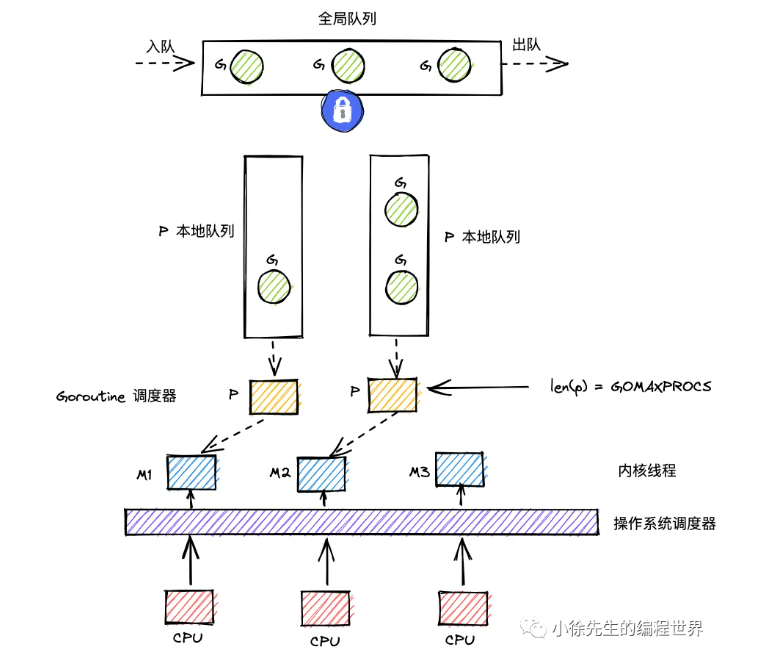

[解说Golang GMP 实现原理_哔哩哔哩_bilibili](https://www.bilibili.com/video/BV1oT411Y7m3/?spm_id_from=333.337.search-card.all.click&vd_source=13dfbe5ed2deada83969fafa995ccff6)

[Weixin Official Accounts Platform](https://mp.weixin.qq.com/s/jIWe3nMP6yiuXeBQgmePDg)

> **并发 Concurrency**：指程序在一段时间内处理多个任务。它强调的是“任务之间可以交替推进”，不一定真的在同一时刻执行。
>
> **并行 Parallelism**：指多个任务在同一时刻真正同时执行。它强调的是“物理上同时发生”，通常需要多核 CPU 或多台机器。

线程：通常指的是内核级线程：

1. 是OS中最小调度单元
2. 创建、销毁、调度交由内核完成，cpu需要完成用户态和内核态的切换
3. 可以充分利用多核，实现并行

协程，通常为用户级线程：

1. 与线程存在映射关系，协程：线程 M：1
2. xxx由用户态完成，对内核透明，所以更轻
3. 从属于同一个内核级线程，无法**并行**，一个协程阻塞会导致从属同一线程的所有协程无法执行

 

goroutine，经go优化后的特殊**协程**：

1. 与线程存在映射关系，为 M：N
2. xxx由用户态完成，对内核透明，足够轻便
3. 可利用多个线程，实现并行
4. 通过调度器的调度，实现和线程间的动态绑定和灵活调度
5. 栈空间大小可动态扩展

| 模型      | 弱依赖内核 | 可并行 | 可应对阻塞 | 栈可动态扩缩 |
| --------- | ---------- | ------ | ---------- | ------------ |
| 线程      | ❌          | ✅      | ✅          | ❌            |
| 协程      | ✅          | ❌      | ❌          | ✅            |
| goroutine | ✅          | ✅      | ✅          | ✅            |

## GMP模型

GMP = goroutine ＋ machine ＋ processor

> machine是OS级线程。
>
> processor是调度器。

**G**有自己的运行栈、状态、以及执行的任务函数。G需要绑定P才能执行，在G的视角中，P就是它的cpu。

**P**是GMP的中枢，由P承上启下，实现G和M之间的动态有机结合。对G而言P是cpu，G只有被P调用才可以执行。

对于M而言，P是执行代理，为其提供必要信息的同时，隐藏了复杂的调度细节。

P的数量决定了G最大并行数量。

**M**不直接执行G，而是先和P绑定，由其实现代理。借由P的存在，M无需和G绑定死，也无需记录G的状态信息。G在生命周期中可以实现跨M执行。

G的存在队列有三类：P的本地队列；全局队列；和wait队列（为io阻塞就绪态goroutine队列）

M调度G时，优先取P本地队列，其次取全局队列，最后取wait队列。这样的好处是取本地队列时，可以接近于无锁化，减少全局锁竞争。

为防止不同P的负载过大，设立work-stealing机制，本地队列为空的P可以尝试从其他P本地队列调度一半的G补充到自身队列。

## 核心数据结构

