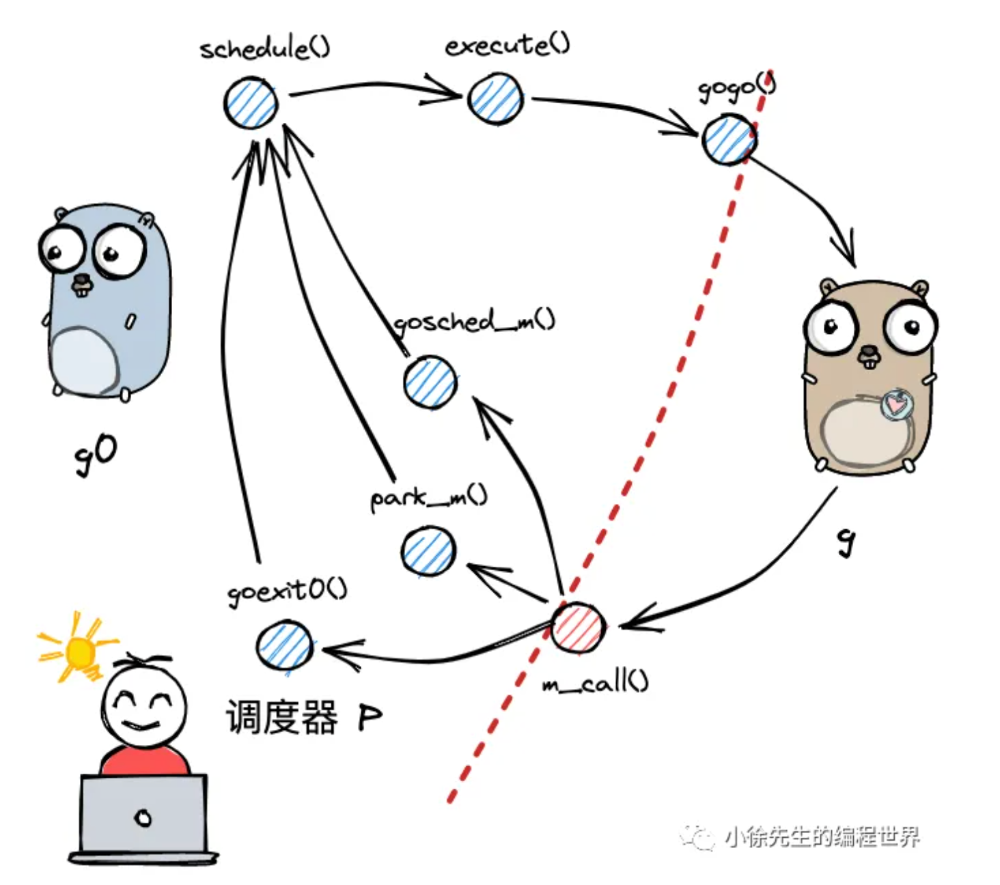
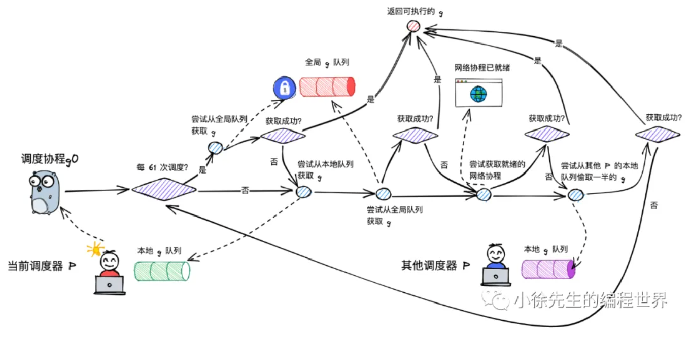
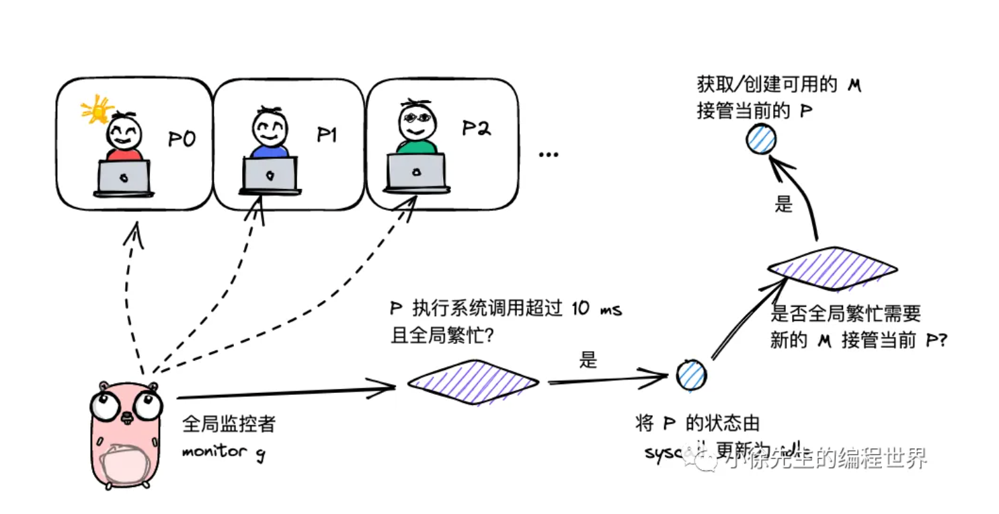

[解说Golang GMP 实现原理_哔哩哔哩_bilibili](https://www.bilibili.com/video/BV1oT411Y7m3/?spm_id_from=333.337.search-card.all.click&vd_source=13dfbe5ed2deada83969fafa995ccff6)

[Weixin Official Accounts Platform](https://mp.weixin.qq.com/s/jIWe3nMP6yiuXeBQgmePDg)

https://2637309949.github.io/go-interview/#/docs%2FGo%2FGPM%E8%B0%83%E5%BA%A6%E6%A8%A1%E5%9E%8B

> **并发 Concurrency**：指程序在一段时间内处理多个任务。它强调的是“任务之间可以交替推进”，不一定真的在同一时刻执行。
>
> **并行 Parallelism**：指多个任务在同一时刻真正同时执行。它强调的是“物理上同时发生”，通常需要多核 CPU 或多台机器。

线程：通常指的是内核级线程：

1. 是OS中最小调度单元
2. 创建、销毁、调度交由内核完成，cpu需要完成用户态和内核态的切换
3. 可以充分利用多核，实现并行

协程，通常为用户级线程：

1. 与线程存在映射关系，协程：线程 M：1
2. xxx由用户态完成，对内核透明，所以更轻
3. 从属于同一个内核级线程，无法**并行**，一个协程阻塞会导致从属同一线程的所有协程无法执行

 

goroutine，经go优化后的特殊**协程**：

1. 与线程存在映射关系，为 M：N
2. xxx由用户态完成，对内核透明，足够轻便
3. 可利用多个线程，实现并行
4. 通过调度器的调度，实现和线程间的动态绑定和灵活调度
5. 栈空间大小可动态扩展


| 模型      | 弱依赖内核 | 可并行 | 可应对阻塞 | 栈可动态扩缩 |
| --------- | ---------- | ------ | ---------- | ------------ |
| 线程      | ❌          | ✅      | ✅          | ❌            |
| 协程      | ✅          | ❌      | ❌          | ✅            |
| goroutine | ✅          | ✅      | ✅          | ✅            |


## GMP模型

GMP = goroutine ＋ machine ＋ processor

> machine是OS级线程。
>
> processor是调度器。


**G**有自己的运行栈、状态、以及执行的任务函数。G需要绑定P才能执行，在G的视角中，P就是它的cpu。


**P**是GMP的中枢，由P承上启下，实现G和M之间的动态有机结合。对G而言P是cpu，G只有被P调用才可以执行。

对于M而言，P是执行代理，为其提供必要信息的同时，隐藏了复杂的调度细节。

P的数量决定了G最大并行数量。


**M**不直接执行G，而是先和P绑定，由其实现代理。借由P的存在，M无需和G绑定死，也无需记录G的状态信息。G在生命周期中可以实现跨M执行。


G的存在队列有三类：P的本地队列；全局队列；和wait队列（为io阻塞就绪态goroutine队列）

M调度G时，优先取P本地队列，其次取全局队列，最后取wait队列。这样的好处是取本地队列时，可以接近于无锁化，减少全局锁竞争。

为防止不同P的负载过大，设立work-stealing机制，本地队列为空的P可以尝试从其他P本地队列调度一半的G补充到自身队列。

## 核心数据结构

GMP 相关结构主要在 `runtime/runtime2.go` 中，字段很多，只抓调度相关的核心部分。

### g

`g` 表示 goroutine，核心字段是 `m *m` 和 `sched gobuf`。

- `m`：当前负责执行该 `g` 的 OS 线程。
- `sched`：保存 `g` 被切走时的执行现场。其中 `sp` 是栈顶，`pc` 是下一条指令地址，`ret` 保存返回值，`bp` 保存栈帧基址。

`g` 常见状态：

- `_Gidle`：创建中，尚未初始化完成。
- `_Grunnable`：可运行，等待调度。
- `_Grunning`：正在运行。
- `_Gsyscall`：正在执行系统调用。
- `_Gwaiting`：阻塞等待，如 channel、锁、GC、timer 等。
- `_Gdead`：未使用或已经结束。
- `_Gcopystack`：正在进行栈扩缩容。
- `_Gpreempted`：被抢占，等待再次调度。

### m

`m` 表示 OS 线程，真正执行代码的是它。

- `g0`：每个 `m` 独有的调度 goroutine，只负责调度和切换，不执行用户代码。
- `tls`：线程本地存储，用来快速找到当前正在运行的 `g`，再顺着找到 `m`、`p`、`g0`。

### p

`p` 表示调度资源，可以理解为运行 `g` 所需的“执行令牌”。

- `runq`：本地可运行队列，容量为 256。
- `runqhead/runqtail`：维护本地队列的头尾。
- `runnext`：下一个优先执行的 `g`。

### schedt

`schedt` 是全局调度器状态。

- `lock`：操作全局队列时使用的锁。
- `runq`：全局可运行队列。
- `runqsize`：全局队列中的 `g` 数量。

整体调度顺序可以简化为：优先取 `p.runnext`，其次取 `p.runq`，再取全局 `sched.runq`，最后尝试从其他 `p` 偷任务。


## 调度流程

### 两种 g 的转换

goroutine 可以简单分成两类：

- `g0`：每个 `m` 都有一个，只负责调度、切换、栈管理等 runtime 工作，不执行用户代码。
- 普通 `g`：执行用户函数，也就是我们通过 `go func(){}` 创建的 goroutine。

`m` 在执行过程中，本质上是在 `g0` 和普通 `g` 之间来回切换，而不是直接从一个普通 `g` 切到另一个普通 `g`。

```text
普通 g1 -> g0 -> 普通 g2
```

其中两个关键方法是：

```go
func gogo(buf *gobuf)
func mcall(fn func(*g))
```

- `gogo`：从 `g0` 切到普通 `g`。它会恢复 `g.sched` 中保存的 `sp`、`pc` 等现场，让普通 `g` 继续执行用户代码。
- `mcall`：从普通 `g` 切回 `g0`。普通 `g` 阻塞、让出、结束或被抢占时，会通过它把执行权交还给 `g0`。

整体流程可以简化为：

```text
g0 查找可运行 g
  -> gogo 切到普通 g
  -> 普通 g 执行用户代码
  -> 普通 g 阻塞 / 让出 / 结束 / 被抢占
  -> mcall 切回 g0
  -> g0 继续调度下一个 g
```

因此，`g0` 可以理解为调度中转站：普通 `g` 只负责执行用户逻辑，一旦需要调度，就把控制权交回 `g0`，由 `g0` 决定接下来运行哪个 `g`。


### 调度类型

这里的“调度”是广义概念，指 `p` 从执行一个 `g` 切换到另一个 `g` 的过程。常见类型有四种。

#### 主动调度

当前 `g` 主动让出执行权，典型方式是调用 `runtime.Gosched()`。

```go
func Gosched() {
    checkTimeouts()
    mcall(gosched_m)
}
```

`Gosched` 会通过 `mcall` 切回 `g0`，当前 `g` 从运行态重新进入可运行队列，等待下一次调度。

```text
_Grunning -> _Grunnable
```

#### 被动调度

当前 `g` 因条件不满足而阻塞，比如 channel 读写、互斥锁等待、timer 等。底层常见入口是 `gopark`。

```go
func gopark(...) {
    mcall(park_m)
}
```

`gopark` 会让当前 `g` 进入等待状态，并切回 `g0` 调度其他 `g`。

```text
_Grunning -> _Gwaiting
```

当等待条件满足后，runtime 会通过 `goready` 将其唤醒，重新放回可运行队列。

```go
func goready(gp *g, traceskip int) {
    systemstack(func() {
        ready(gp, traceskip, true)
    })
}
```

```text
_Gwaiting -> _Grunnable
```

#### 正常调度

当前 `g` 的用户函数执行完成后，会切回 `g0`，并将自身置为死亡状态，随后 `g0` 发起新一轮调度。

```text
_Grunning -> _Gdead
```

#### 抢占调度

如果某个 `g` 长时间运行，或者陷入系统调用太久，runtime 会尝试抢占，避免它长期占用调度资源。

前三种调度通常由当前 `m` 的 `g0` 完成；抢占调度比较特殊，常由全局监控线程 `sysmon` 从第三方视角发起。因为系统调用会让 `m` 进入内核态，此时当前 `m` 无法主动完成调度，`sysmon` 会定期检查所有 `p` 的运行情况。

系统调用场景可以简化为：

```text
g 进入 syscall
  -> m 陷入内核态
  -> sysmon 发现阻塞过久
  -> p 与 m 解绑
  -> p 去调度其他 g
  -> syscall 返回后，原 g 重新等待调度
```

整体来看：

```text
主动调度：g 主动让出，重新排队
被动调度：g 条件不满足，阻塞等待唤醒
正常调度：g 执行完成，进入死亡状态
抢占调度：runtime 从外部干预，释放调度资源
```


### 宏观调度流程

前面把 `G`、`M`、`P` 以及几类调度方式拆开看了，这里可以把它们串成一条完整链路。以 `g0 -> g -> g0` 的一轮循环为例：



1. `g0` 执行 `schedule`，准备寻找下一个可运行的普通 `g`。
2. `schedule` 通过 `findRunnable` 找到合适的 `g`。
3. 找到后，`execute` 会更新当前 `M`、`P`、`G` 的运行状态。
4. 随后通过 `gogo` 从 `g0` 切到普通 `g`，开始执行用户代码。
5. 普通 `g` 因主动让出、阻塞、正常结束或被抢占等原因，通过 `mcall` 把执行权交回 `g0`。
6. `g0` 再次进入 `schedule`，开启下一轮调度。

因此，`M` 并不是直接从一个普通 `g` 切到另一个普通 `g`，而是始终通过自己的 `g0` 做中转。`g0` 负责调度和上下文切换，普通 `g` 负责执行用户逻辑。

`findRunnable` 的核心任务是为当前 `P` 找一个可运行的 `g`。查找顺序大致如下：



1. 定期检查全局队列，避免全局队列中的 `g` 长期得不到执行。
2. 优先检查当前 `P` 的 `runnext` 和本地队列，这是最快路径，也能减少全局锁竞争。
3. 如果本地队列为空，再检查全局队列。
4. 如果仍然没有任务，再检查 `netpoll` 中已经就绪的网络 IO goroutine。
5. 最后尝试 work stealing，从其他 `P` 的本地队列中偷取一部分任务。

这里有两个重要的平衡点：

- 本地队列优先：大部分调度都在当前 `P` 内完成，访问成本低。
- 全局队列和 work stealing 兜底：避免某些 `P` 过忙、某些 `P` 空闲，也避免全局队列中的任务饿死。

当一个 `P` 的本地队列满了，runtime 不会继续硬塞，而是会把本地队列中的一部分 `g` 转移回全局队列。这样其他 `P` 就有机会分担压力，整个调度系统也更均衡。

所以 GMP 的宏观调度可以概括为：`g0` 负责找活和切换，普通 `g` 负责执行；任务优先从本地队列取，取不到再看全局队列、网络就绪队列，最后通过 work stealing 做负载均衡。


#### execute

当 `g0` 通过 `findRunnable` 找到可执行的普通 `g` 后，接下来就会进入 `execute` 阶段。它的作用不是继续寻找任务，而是把已经选中的 `g` 真正交给当前 `M` 执行。

`execute` 主要做三件事：

1. 建立当前 `M` 和目标 `g` 的绑定关系。当前 `M` 会把自己的 `curg` 指向这个 `g`，这个 `g` 也会记录自己正在由哪个 `M` 执行。
2. 更新运行状态。目标 `g` 会从 `_Grunnable` 切换为 `_Grunning`，表示它已经从“等待运行”变成“正在运行”。
3. 通过 `gogo` 切换执行权。从这一刻开始，执行栈会从 `g0` 的调度栈切到普通 `g` 的用户栈，goroutine 中的任务正式开始运行。

此外，如果这次调度没有继承上一个 `g` 的时间片，当前 `P` 的调度次数也会增加。这个计数会影响后续调度策略，比如定期检查全局队列，避免全局队列中的 `g` 长期得不到执行。

所以，`execute` 可以理解为调度流程中的“执行前准备”：前面的 `findRunnable` 负责找到谁能跑，`execute` 负责把它绑定好、改好状态，然后真正切过去运行。


### 主动让渡、被动阻塞

普通 `g` 执行过程中，如果需要让出执行权，都会先通过 `mcall` 切回 `g0`，再由 `g0` 执行具体的调度逻辑。主动让渡和被动阻塞的区别在于：让渡后的 `g` 是否还能继续运行。

#### gosched_m

`gosched_m` 对应主动让渡，典型入口是 `runtime.Gosched`。它表示当前 `g` 还能继续执行，只是主动把执行机会让出来，让其他 goroutine 先运行。

整体流程是：

1. 当前普通 `g` 通过 `mcall` 切回 `g0`。
2. `g0` 将当前 `g` 从 `_Grunning` 改为 `_Grunnable`。
3. 解除当前 `M` 和这个 `g` 的绑定关系。
4. 将这个 `g` 放入全局队列。
5. `g0` 调用 `schedule`，开启下一轮调度。

主动让渡的关键点是：当前 `g` 并没有阻塞，它只是从“正在运行”变回“等待运行”，之后仍然可以被调度器重新选中。

#### park_m

`park_m` 对应被动阻塞，常见场景包括 channel 读写阻塞、锁等待、timer 等。此时不是当前 `g` 想让出，而是它暂时没有继续执行的条件。

整体流程是：

1. 当前普通 `g` 通过 `mcall` 切回 `g0`。
2. `g0` 将当前 `g` 从 `_Grunning` 改为 `_Gwaiting`。
3. 解除当前 `M` 和这个 `g` 的绑定关系。
4. `g0` 调用 `schedule`，继续调度其他可运行的 `g`。

被动阻塞的关键点是：当前 `g` 已经不具备运行条件，所以不会马上重新进入可运行队列，而是停留在等待状态，直到条件满足后被唤醒。

#### ready

当阻塞条件满足后，其他正在运行的 `g` 或 runtime 逻辑会通过 `goready` / `ready` 唤醒这个等待中的 `g`。

唤醒流程可以理解为：

1. 将目标 `g` 从 `_Gwaiting` 改为 `_Grunnable`。
2. 将这个 `g` 放入唤醒者所在 `P` 的本地队列。
3. 等后续调度器取到它时，它就可以继续执行。

如果唤醒者的本地队列已经满了，runtime 会把队列中的一部分 `g` 连同新唤醒的 `g` 一起转移到全局队列，避免单个 `P` 的任务堆积过多。

三者可以简单对比：

- `gosched_m`：还能跑，只是主动让一下，状态从 `_Grunning` 回到 `_Grunnable`。
- `park_m`：暂时跑不了，进入等待，状态从 `_Grunning` 变为 `_Gwaiting`。
- `ready`：等待条件满足后被唤醒，状态从 `_Gwaiting` 回到 `_Grunnable`。


### 调度结束与抢占调度

前面的 `gosched_m` 和 `park_m` 分别处理主动让渡和被动阻塞。除此之外，普通 `g` 还可能因为执行完成而退出，也可能因为系统调用导致调度资源被 runtime 抢回。

#### goexit0

当一个普通 `g` 的用户函数执行完成后，会先通过 `mcall` 切回当前 `M` 的 `g0`，再由 `g0` 执行 `goexit0` 做收尾。

`goexit0` 的核心流程是：

1. 将当前 `g` 从 `_Grunning` 改为 `_Gdead`。
2. 解除当前 `g` 和 `M` 的绑定关系。
3. 回到 `schedule`，继续寻找下一个可运行的 `g`。

它和前面几类调度的区别在于：`gosched_m` 是“还能跑，只是先让出”，`park_m` 是“暂时不能跑，进入等待”，而 `goexit0` 是“已经跑完，不再参与调度”。

#### retake



`retake` 主要处理系统调用场景下的抢占。普通 `g` 进入系统调用后，当前 `M` 可能会长时间卡在内核态。如果这个 `M` 一直占着 `P`，那么这个 `P` 上的其他 goroutine 就无法继续执行。

因此，runtime 中的全局监控逻辑会定期检查所有 `P`。如果发现某个 `P` 长时间处于 `_Psyscall` 状态，并且本地队列还有任务，或者当前调度资源比较紧张，就会尝试把这个 `P` 从原来的 `M` 手里拿回来。

抢回 `P` 后，runtime 会通过 `handoffp` 判断是否需要立刻找一个新的 `M` 接管。如果当前 `P` 本地队列有任务、全局队列有任务，或者需要处理网络轮询，就会通过 `startm` 唤醒空闲的 `M`；如果没有空闲 `M`，就创建新的 `M`。

这里的核心原则是：`M` 可以因为系统调用阻塞，但 `P` 不能一直陪着它阻塞。`P` 是调度资源，要尽量流动起来，让其他 goroutine 有机会继续执行。

#### reentersyscall 和 exitsyscall

`reentersyscall` 发生在普通 `g` 进入系统调用之前。它主要做三件事：

1. 保存当前 `g` 的执行现场，方便系统调用返回后继续执行。
2. 将当前 `g` 从 `_Grunning` 改为 `_Gsyscall`，将当前 `P` 改为 `_Psyscall`。
3. 解除当前 `M` 和 `P` 的绑定，并把原来的 `P` 记录到 `M.oldp` 中。

这样做的原因是：`M` 马上要进入内核态，短时间内可能无法继续参与 Go 调度，所以需要先把 `P` 释放出来，避免调度资源被长期占用。

`exitsyscall` 发生在系统调用返回之后。此时当前 `g` 想继续执行，但它必须重新拿到一个 `P`。

它会先尝试快速路径：如果之前记录的 `oldp` 还可用，就重新绑定这个 `P`，并把当前 `g` 从 `_Gsyscall` 改回 `_Grunning`，继续执行用户代码。

如果 `oldp` 不可用，就会走慢路径：当前 `g` 先切回 `g0`，再尝试获取其他空闲 `P`。如果拿到了 `P`，就继续执行当前 `g`；如果拿不到，就把当前 `g` 改为 `_Grunnable` 并放入全局队列，当前 `M` 进入休眠，等待后续被唤醒。

所以系统调用前后的完整思路是：进入系统调用前释放 `P`，返回后重新争取 `P`。这也是 GMP 能在系统调用阻塞时继续调度其他 goroutine 的关键。

整体对比如下：

- `goexit0`：普通 `g` 执行完成，状态从 `_Grunning` 变为 `_Gdead`。
- `retake`：监控线程发现 `P` 被系统调用占用太久，尝试抢回 `P`。
- `reentersyscall`：进入系统调用前保存现场，并释放 `P`。
- `exitsyscall`：系统调用返回后，尝试重新获取 `P` 并继续执行。
