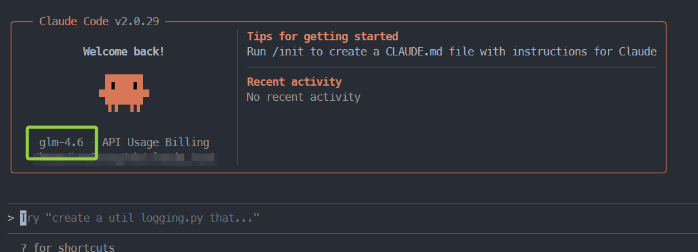
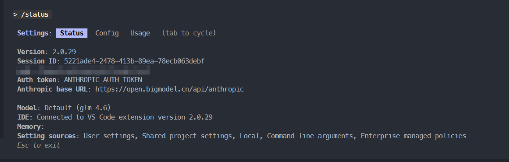
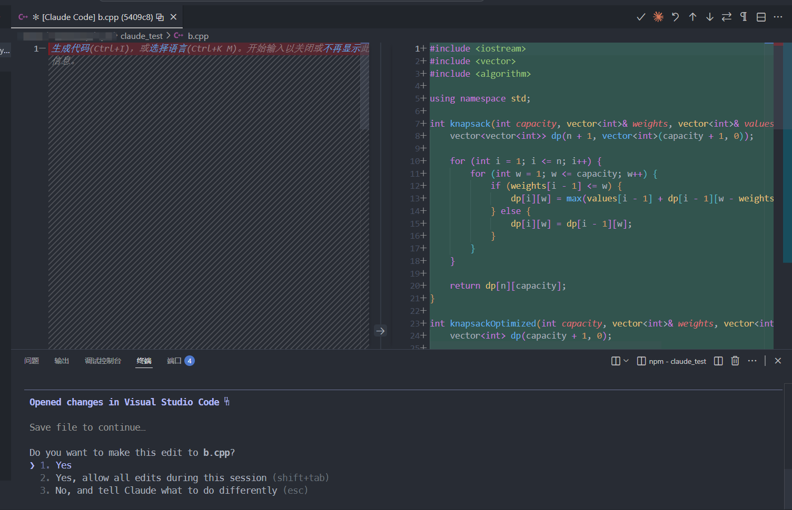
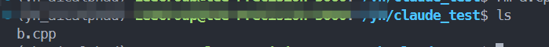
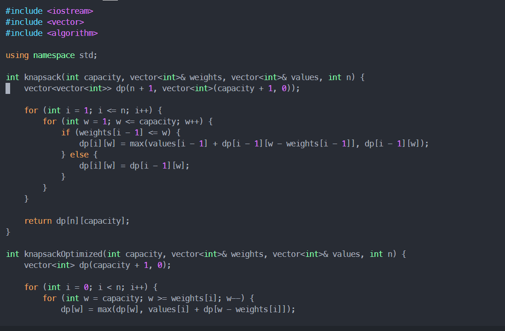

linux上配置`claude code`＋`chatglm`模型还是比较容易的，根据官网[Claude Code - 智谱AI开放文档 (bigmodel.cn)](https://docs.bigmodel.cn/cn/coding-plan/tool/claude)操作基本就可以。

但是官网上是全局安装，这里提供一个非全局安装的。

使用下面命令安装（少了`-g`）：

```shell
npm install @anthropic-ai/claude-code
```

在非全局中，不能在命令行直接使用`claude`这个命令，要用`npm claude`。

查看是否安装上：

```shell
npm claude --version
```

显示了版本号就表明安装成功了。

在`~/.claude`目录下新建一个`settings.json`文件，并写入：

```json
{
    "env": {
        "ANTHROPIC_AUTH_TOKEN": "your_zhipu_api_key",
        "ANTHROPIC_BASE_URL": "https://open.bigmodel.cn/api/anthropic",
        "API_TIMEOUT_MS": "3000000",
        "CLAUDE_CODE_DISABLE_NONESSENTIAL_TRAFFIC": 1,
         "ANTHROPIC_DEFAULT_HAIKU_MODEL": "glm-4.5-air",
    "ANTHROPIC_DEFAULT_SONNET_MODEL": "glm-4.6",
    "ANTHROPIC_DEFAULT_OPUS_MODEL": "glm-4.6"
    }
}
```

`your_zhipu_api_key`使用在[智谱AI开放平台 (bigmodel.cn)](https://bigmodel.cn/usercenter/proj-mgmt/apikeys)上面申请的api。

使用`npm exec claude`命令进入claude code工具：

```shell
npm exec claude
```




输入`/status`查看相关信息



可以看到模型为`glm`系列就算成功了。

进行简单测试：

```
使用cpp写一个01背包算法，并保存到b.cpp文件内
```



选择确定`1`。

等待写入。



查看可以看到`b.cpp`文件




目前使用没有遇到权限问题（