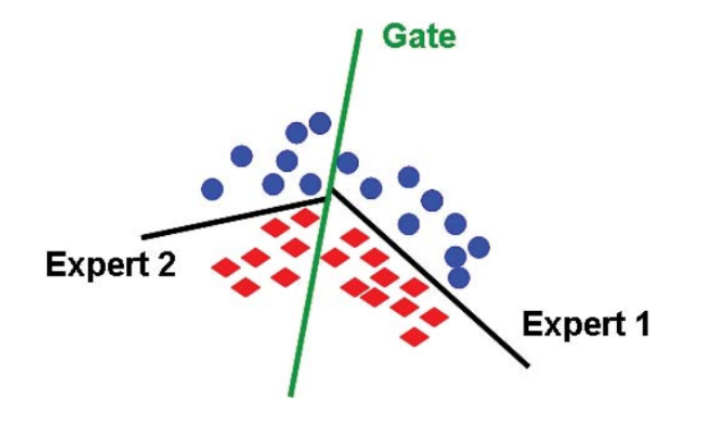
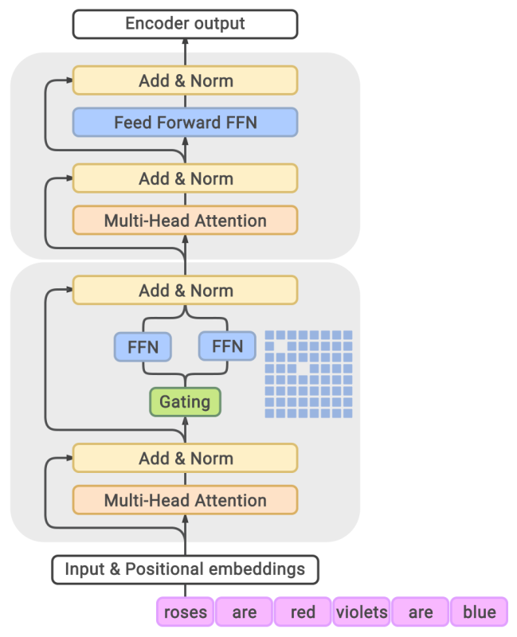
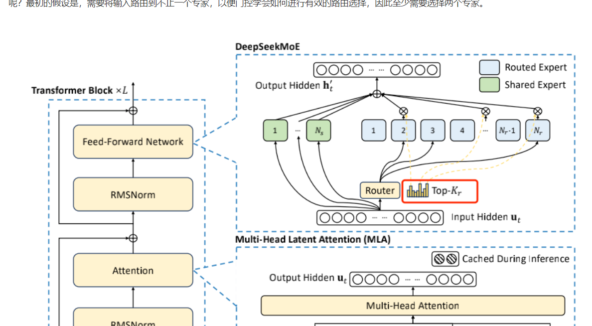

> 混合专家模型：创建一组专家。每个输入只激活一小部分专家。

假设预测一个$d$分类问题，使用前馈神经网络可能它的表达能力不足，需要加宽、加深。

专家的混和方法是：定义$E$个专家，每个专家都有自己的嵌入$w_e \in R^d$，将门控函数定义为$E$个专家上的概率分布：
$$
g_e(x) = \frac {exp(w_e \times x)} {\sum_{e^` = 1}^Eexp(w_e^` \times x)}
$$
每个专家都有自己的参数$\theta^{{e}} = (W_1^{(e)}, W_2^{(e)})$，最终函数定义为专家的混和：
$$
f(x) = \sum_{e=1}^{E}g_e(x)h_{\theta}(x)
$$

> $g_e$是gating，$h$是expert

当$d=$时，且每个专家都是一个线性分类器时

可以通过反向传播来学习混和专家模型。

**专家的混合不会节省任何计算，因为前向传播仍然需要评估每个专家，而反向传播也必须接触每个专家。**

将门控函数进行近视，只选择非零门控函数值的专家，**这样可以节约计算**。

只有所有专家都参与进来，混和专家才有效。如果只有一个专家处于活跃状态，那么会造成浪费，同时如果一直处于这种状态，那么未使用的专家梯度将为零，不会收到任何梯度并得到改善。

**因此，混和专家需要确保所有专家都能被输入使用**。

混和专家有利于并行，**每个专家都可以放置在不同的机器上。**

混和专家思想应用到语言模型：前馈层对于每个token是独立的，可以将每个前馈网络转变为混和专家前馈网络，隔离层使用MoE Transformer block

deepseek-v3：

MoE中的门控网络对应的是DeepSeekMoE的Router模块

[so-large-lm/docs/content/ch04.md at main · datawhalechina/so-large-lm (github.com)](https://github.com/datawhalechina/so-large-lm/blob/main/docs/content/ch04.md)